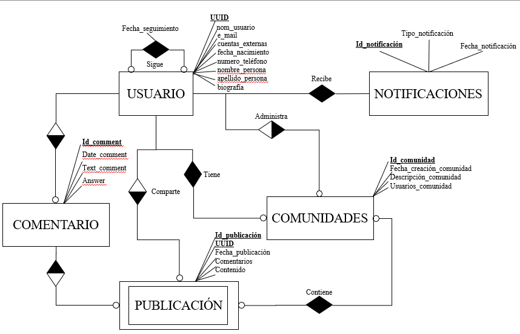
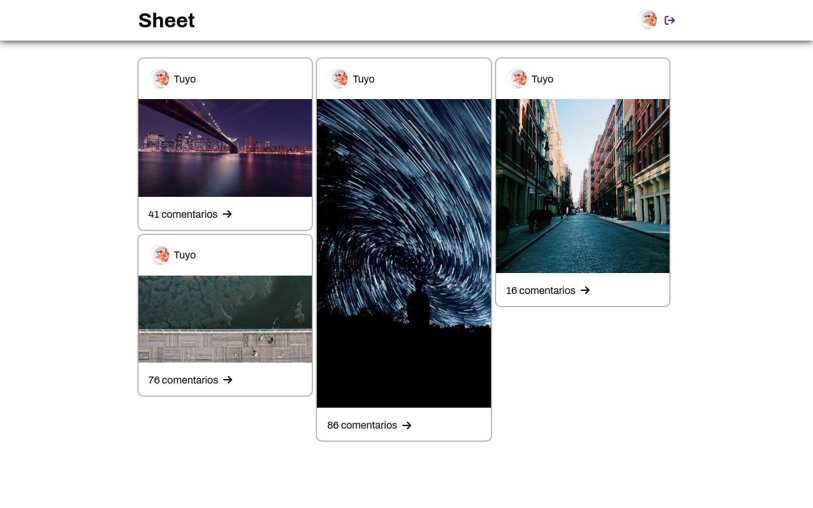
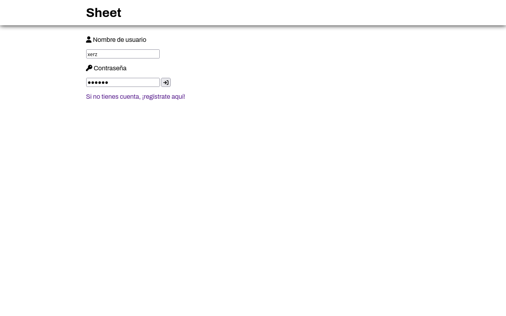
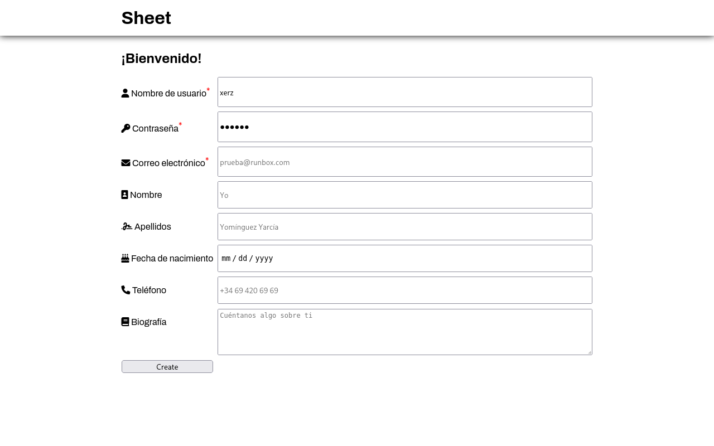

# Sheet

Sheet es una red social que permite a sus usuarios centralizar las publicaciones de sus redes en una sola.
Se podrá iniciar sesión con cuentas de otras redes sociales,
así como seguir a usuarios que se unan, ver sus publicaciones y comentar en ellas.

## Funcionalidad
- Pública
    - Acceso a perfiles públicos
    - Registro de cuenta nueva
- Privada
    - Administrar perfil
    - Seguir cuentas
    - Ver publicaciones
    - Crear publicaciones
    - Comentar
    - Recibir notificaciones

## Entidades
- Usuarios
- Publicaciones
- Notificaciones
- Comunidades

## Modelo Entidad/Relación

- 1:N
    - Un usuario puede compartir varias publicaciones o ninguna.
    - Las publicaciones solo pueden ser creadas por un usuario.
    - Un usuario puede administrar (crear, modificar y eliminar) varias comunidades.
    - Una comunidad solo puede ser administrada por un usuario.

- N:N
    - Los usuarios tienen la opción de comentar en las publicaciones, y las publicaciones podrán ser comentadas por varios usuarios (Siempre se tendrá un comentario que contendra la fecha y el usuario de la publicación, y de forma opcional una descripción).
    - Un usuario puede estar o tener varias comunidades.
    - Las comunidades pueden tener varios usuarios (mínimo 1).
    - Los usuarios podrán seguirse entre ellos, por lo que, una persona puede seguir a varios perfiles, y estos, podrían seguirle a él.
    - Las comunidades pueden contener varias publicaciones, al igual que, una publicación puede estar en distintas comunidades.
    - Los usuario recibiran varias publicaciones, además, existirán notificaciones del sistema que serán recibidas por todos los usuarios.

## Servicios web
- Interfaz de usuario
- Publicaciones
- Obtención de muro
- Almacenamiento de datos

## Servicios internos
- Autenticación
- Notificaciones
- Envío de correo
- Escalado de imágenes
- Compresión de vídeo

## Páginas

### Mural de publicaciones

Esta es la página con la que el usuario será bienvenido cada vez que se conecte.
Muestra sus últimas publicaciones así como las de de las cuentas a las que sigue.
Esta página es privada y solo está disponible con una cookie de sesión.

### Perfil de usuario

Para que cualquiera pueda descubrir y examinar las publicaciones de un usuario,
sus perfiles están disponibles públicamente sin necesidad de iniciar sesión.

### Inicio de sesión

La primera vez que se abre Sheet en una sesión web, aparecerá este menú de inicio de sesión.
Permite tanto insertar credenciales para una cuenta existente, como solicitar registrar una nueva.

### Formulario de registro

Si no se dispone de cuenta de usuario, basta con rellenar los datos del formulario de registro
para ponerse en marcha.